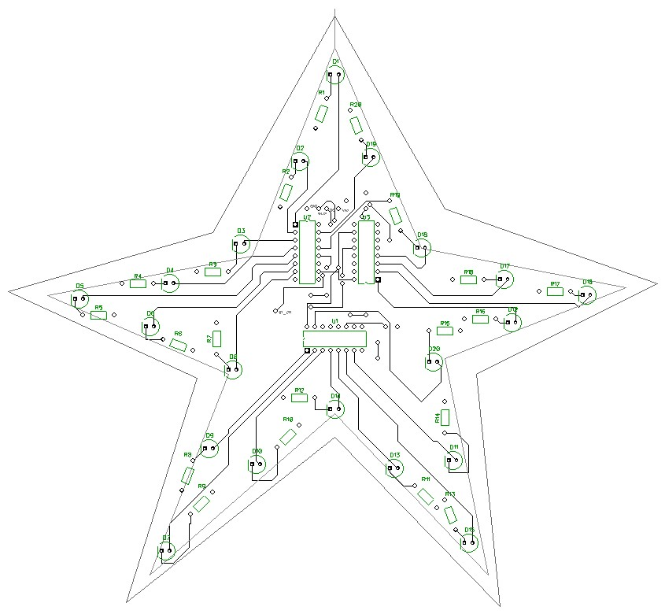
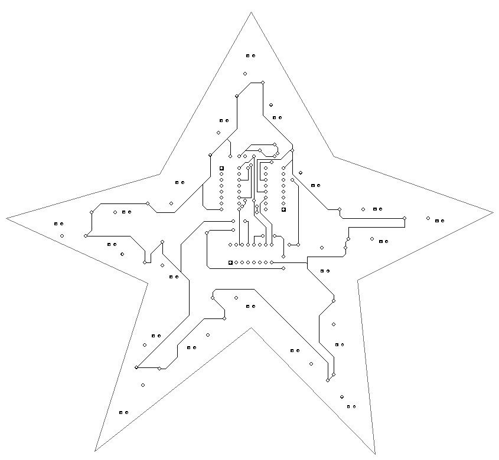

# Star

## Electronic components
В данной схеме используется такие электронные компоненты

* Сдвиговый регистр 74HC595 - 3 шт.
* Светодиоды 3мм. или 5мм. - 20 шт.
* Токоограничивающие резисторы (было использовано на 220R) - 20шт.

Основные выходы схемы:

GND   SH_CP  DC  VCC

ST_CP

```cpp
#define DATA_PIN 9 //Пин подключен к DS входу 74HC595
#define LATCH_PIN 10 //Пин подключен к ST_CP входу 74HC595
#define CLOCK_PIN 11 //Пин подключен к SH_CP входу 74HC595
```

## Electronic circuit
### Top


### Bottom

