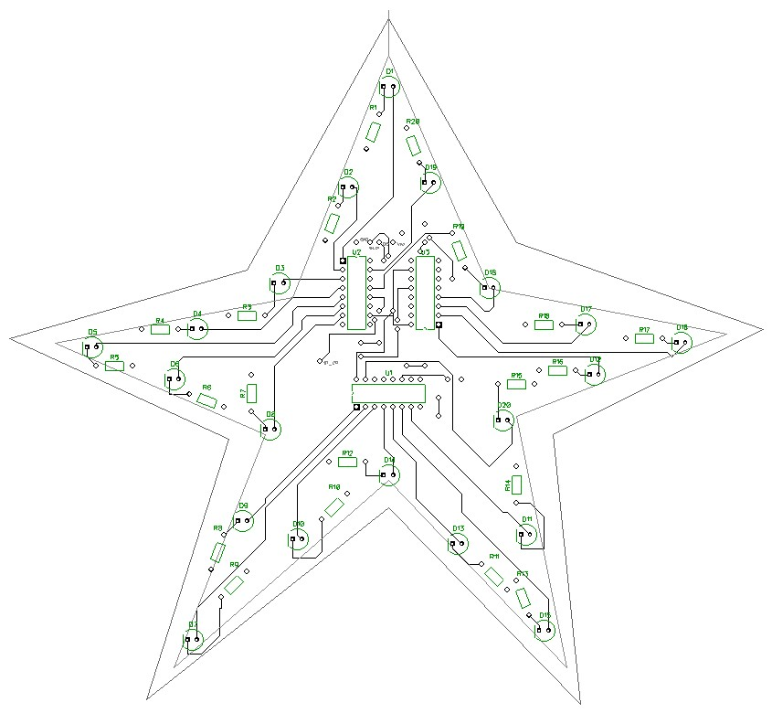

# Star

## Electronic components
В данной схеме используется такие электронные компоненты

* Сдвиговый регистр 74HC595 - 3 шт.
* Светодиоды 3мм. или 5мм. - 20 шт.
* Токоограничивающие резисторы (было использовано на 220R) - 20шт.

## Electronic circuit

